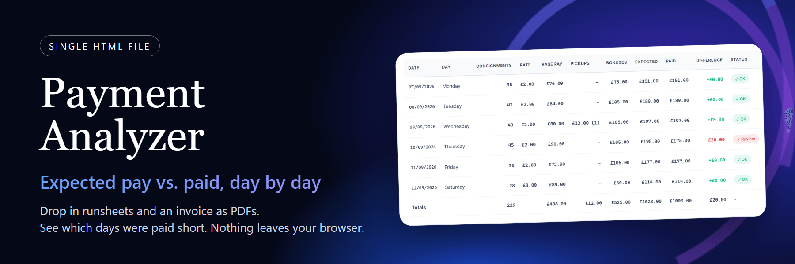
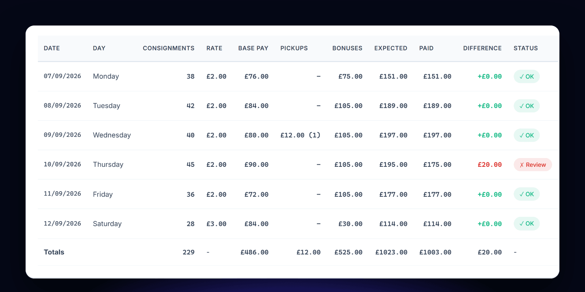
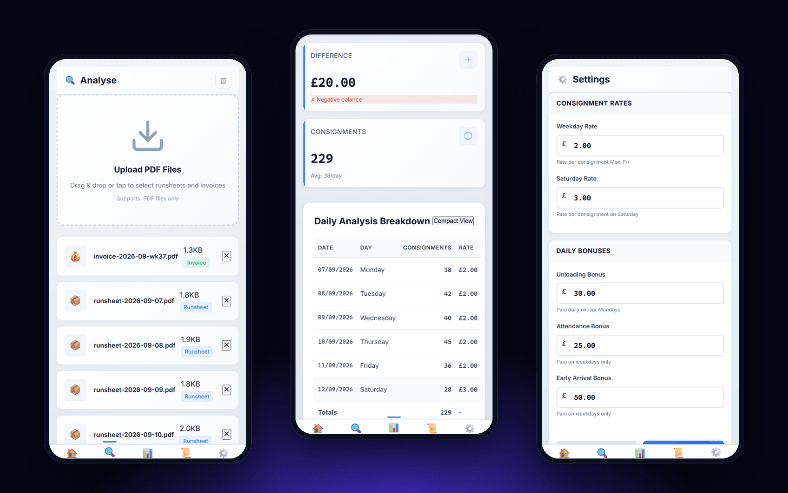
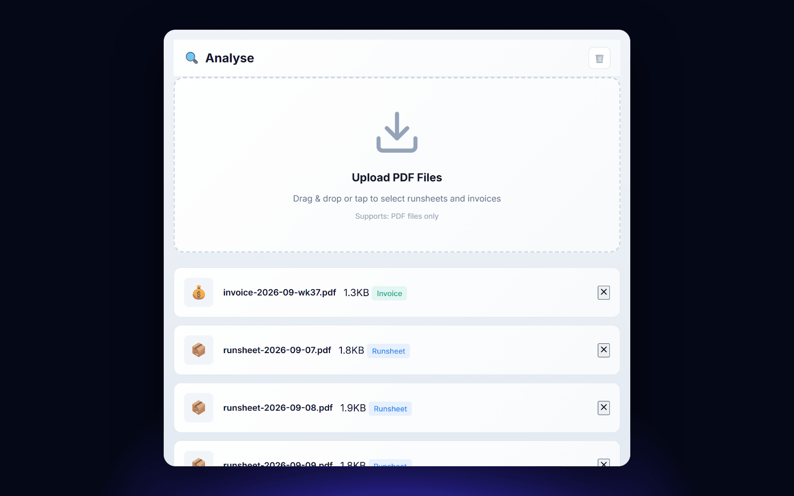

<p align="center">
  
  
  
  
  
</p>

## What it is

Payment Analyzer checks a courier's pay against the paperwork.

You give it the daily runsheets and the invoice as PDFs. It counts the deliveries on each runsheet, works out what should have been paid under your rates, and compares that with what the invoice says was paid. Each day gets a row. A day paid more than £5 short is marked for review, and one paid up to £5 short is marked minor.

It is one HTML file. There is no server, no account and no build step.

## Why

A weekly invoice is hard to check by hand. Every day has a consignment count, a rate that changes on Saturday, three different bonuses and the odd pickup. One wrong line is easy to miss and the total still looks plausible.

This puts the sum next to the invoice so the wrong day stands out.

## See it work

The report below uses the sample files in [`docs/sample-data`](docs/sample-data). The names, counts and amounts are made up. Six days are checked and five match. Thursday was paid £20 less than the rules give.



It is built for a phone first. The same screens work on a narrow window.



## How it works

1. **Upload.** Drop in PDFs on the Analyse page. Each file is read in the browser with PDF.js and sorted into runsheet or invoice, by file name first and then by its text.
2. **Read.** From a runsheet it takes the date and counts the delivery and collection lines. From an invoice it takes the amount on each service line, groups them by day, and picks out pickups.
3. **Check the invoice.** The amounts it found are added up and compared with the `Docket Total` printed on the invoice. If they differ by more than one penny, the app shows a warning that the results may be inaccurate, so a misread invoice does not pass quietly.
4. **Apply your rules.** For each day: consignments times the rate, plus the bonuses that apply, plus any pickups.
5. **Compare.** Expected is set against paid, per day and in total.



### The rules

All five values are editable on the Settings page and saved in your browser.

| Rule | Default | When it applies |
|---|---|---|
| Weekday rate | £2.00 | Per consignment, Monday to Friday |
| Saturday rate | £3.00 | Per consignment, Saturday |
| Unloading bonus | £30.00 | Every day with deliveries, except Monday |
| Attendance bonus | £25.00 | Monday to Friday |
| Early arrival bonus | £50.00 | Monday to Friday |

Pickups come from the invoice and are added to the expected amount for that day.

## What you get

| Page | What it does |
|---|---|
| **Analyse** | Upload PDFs, see what was recognised, run the check |
| **Reports** | The daily breakdown, totals and a settlement summary. Print it, or save the analysis as JSON |
| **History** | Past analyses. Uploading the same set of files again is spotted, so you can reuse the saved result instead of making a duplicate |
| **Dashboard** | A monthly or weekly view of expected against paid, with a calendar |
| **Settings** | The five rules, export of one or all analyses as JSON, and a way to clear stored data |

## Run it

```bash
git clone https://github.com/talyssonoliver/payment-analyser.git
cd payment-analyser
```

Open `payment-analyzer-multipage.v9.0.0.html` in a browser. Or serve the folder:

```bash
python -m http.server 8000
```

To try it without real documents, upload the PDFs from [`docs/sample-data`](docs/sample-data): one invoice and six runsheets for the week of 7 to 12 September 2026.

PDF.js and LZ-String are loaded from cdnjs and the Inter font from Google Fonts, so the first load needs a connection.

## Your data

- PDFs are read in the page. Nothing is uploaded anywhere.
- Rules and past analyses are kept in the browser's `localStorage`, compressed with LZ-String when they get large.
- Clearing site data, or the Clear buttons in the app, removes them.
- The only network requests are for those two libraries and the font. Your documents and results are not sent anywhere.

## Good to know

- The parser is written for one courier's layout: runsheets with a `Date:` line and numbered `Delivery` or `Collection` rows, and invoices with dated service lines and a `Docket Total`. Other layouts will need parser changes.
- The business rules above are the ones in the code today. They are not a general payroll engine.
- Everything lives in one file, split into modules inside script tags: router, state, rules, parser, UI, dashboard, analysis, reports, history and settings.

## Built with

| Piece | Used for |
|---|---|
| **HTML, CSS, vanilla JavaScript** | The whole app, with a small module loader and hash router |
| **PDF.js 3.11** | Reading text out of the PDFs in the browser |
| **LZ-String 1.5** | Compressing saved analyses |
| **localStorage** | Rules, history and the last session |

<p align="center">
  <strong>Built by <a href="https://github.com/talyssonoliver">Talysson Oliveira</a></strong> · <a href="https://leangency.com">Leangency</a>
</p>
